# Paper Review
- Name: Muhammad Noor 
- NRP: 05111850010003

# Gamification for Learning Science: ELISA (enzyme-linked immunosorbent assay) Game Study Case

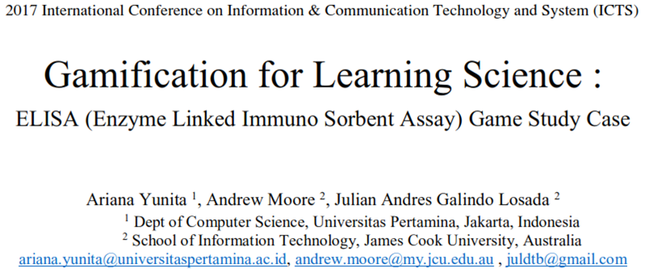

Author :
- Arina Yunita
(Dept of Computer Science, Universitas Pertamina, Jakarta, Indonesia)
- Andrew Moore, Julian Andreas Galindo Losada
(School of Information Technology, James Cook University, Australia)

Conference :
- ICTS 2017: 11th International Conference on Information & Communication Technology and System (IEEE Conference)

Source :

https://ieeexplore.ieee.org/document/8265687

# Paper Structure
- I. Introduction
  - A. Immunology
  - B. ELISA (Enzyme-linked immunosorbent assay)
  - C. ELISA Game
- II. Related Works
- III. Design
  - A. flowchart of The Website
  - B. ELISA Combination
  - C. Database
  - D. Flowchart and Procedure og The Game
- IV. Implementation
  - A. Game Challenges
  - B. Main Menu of ELISA Game
  - C. Antigen Detection Menu
  - D. Antibody Detection Menu
  - E. Main Board of Elisa Game
  - F. Drag and Drop Reagen
  - G. Correct combination
- V. Testing
  - A. Target User
  - B. Result of Implementation to user
  - C. Questionnaire
  - D. Result of Questionnaire
- VI. Conclusions and Future Works

# I. Introduction

## A. Immunology
- Immunology is a science that studies the immune system of human and animal. 
- It is a discipline that in its development rooted in the prevention and treatment of infectious diseases. 
- While Serology is a science that studies the antibody-antigen by invitro. The Serologic examination is often performed as an attempt to make the diagnosis. 
- Although the current serologic examination is not limited to infectious diseases, to support the diagnosis of infectious diseases is often conducted and it allows in vitro observation of antigen-antibody complex changes (Ag-Ab).

## B. ELISA
- ELISA (Enzyme-linked immunosorbent assay) is a serological test commonly used in immunological laboratories. 
- This test has several advantages such as relatively simple, economical, and has a high enough sensitivity.
- ELISA was firstly introduced in 1971 by Peter Perlmann and Eva Engvall to analyze the presence of antigenic interactions with antibodies in a sample using an enzyme as a reporter. 
- To conduct an ELISA test, there are several types of equipment that should be prepared, such as ELISA reader, washer machine, pipe, and microplate. 
- Those equipment are in a various range of price and it will be costly to conduct a real test for a huge number of students. 

## C. ELISA Game
- Therefore, using a simulation game, students can learn the cost independently as well as it can decrease the cost of laboratory practice.
- The author claimed ELISA game is a simulation game because it is fantastical but not competitive.

# II. Related Works
- Games are usually associated with play and play is often associated with children, but a digital game has been found that can be effective and motivational for learning and its effects for both gender: males and females.
- Since it was found that games support learning in complex or boring contexts, researchers have developed and research for effective games for helping education in various fields.
- For example a game for dental learning in higher education, a game of mathematical logic to help computer science students learn about logic and a game for civil engineering students. 
Those games were developed for higher education and found to be effective in their learning environment. 
- Games attempt to be challenging and engaging. For more than ten years, the term “serious game” has been introduced and intended not for entertaining, but for educating, military, health and also training and development.

# III. Design
## A. Flowchart of The Website
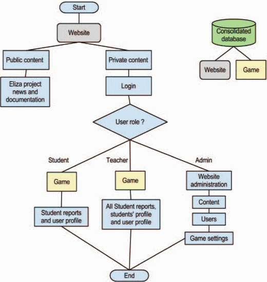

A simulation game called ELISA is designed using Flash Action Script 3.0 and it is embedded on a website built using Drupal CMS.

## B. ELISA Combination
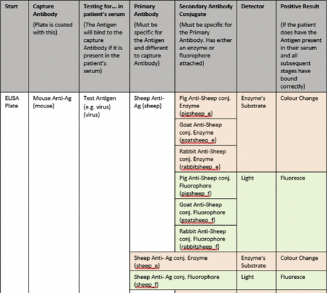

Before designing the database, basic data requirements are given from the Veterinary Science Department which is combinations of ELISA technique.

## C. Database
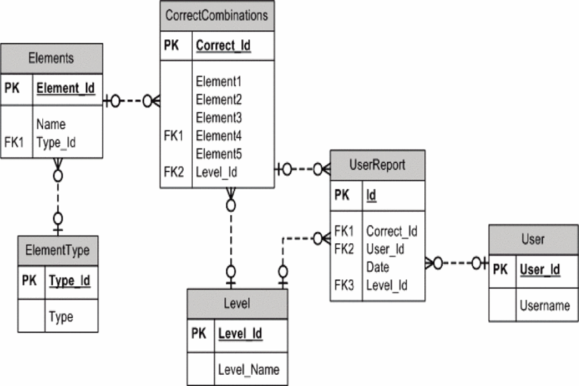

Then, the database could be designed based on the documents of ELISA combinations. Combinations consisting of antibody, antigen, detector, conjugate, capture antibody. They store in ElementType and will be checked in CorrectCombinations entity.

## D. Flowchart and Procedure of The Game
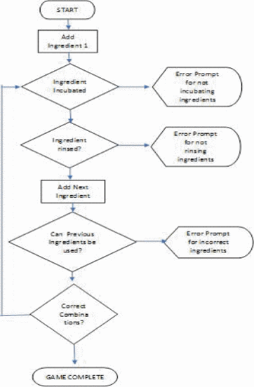

After designing the database, according to procedures of the ELISA method and also correct combinations are given, a game flowchart was designed. 
Basically, every element needs to be incubated and washed. Then, every element that put into the tube could not be the same as the previous ingredients. 

For example, first, we would like to input Capture Antibody which is namely Pig-anti Ag, then it should be incubated and washed, after that another element is chosen and it should be incubated and washed and it will be iterated until the correct combinations are made. 

Error prompt will be displayed once the users not following the ELISA rule.

# IV. Implementation
## A. Game Challenges
- This game challenge users to design an ELISA to detect the two type of detections which are antigen detection and antibody detection. 
- In antigen detection menu, users are challenged to design ELISA for hepatitis B, dengue virus, Ross river virus, influenza, HIV and Herpes virus simplex 1. 
- Furthermore, for antibody detection, users should design ELISA to detect an antibody against one of the following viruses. It includes chicken pox, measles, hepatitis A, rubella.

## B. Main Menu of ELISA Game
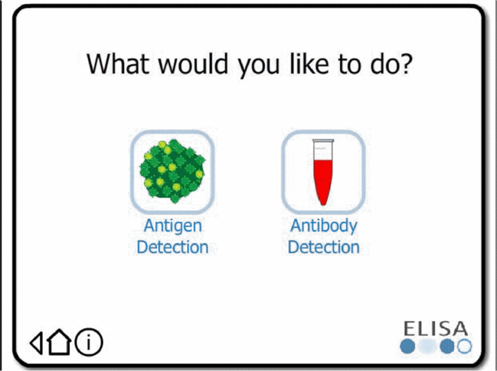

The main menu of ELISA game: kind of simulation will be chosen whether antibody detection or antigen detection

## C. Antigen Detection Menu
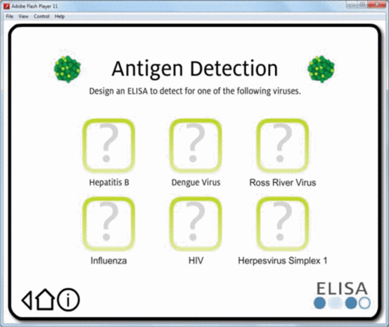

Antigen detection menu: kind of virus will be detected using the antigen detection menu respectively

## D. Antibody Detection Menu
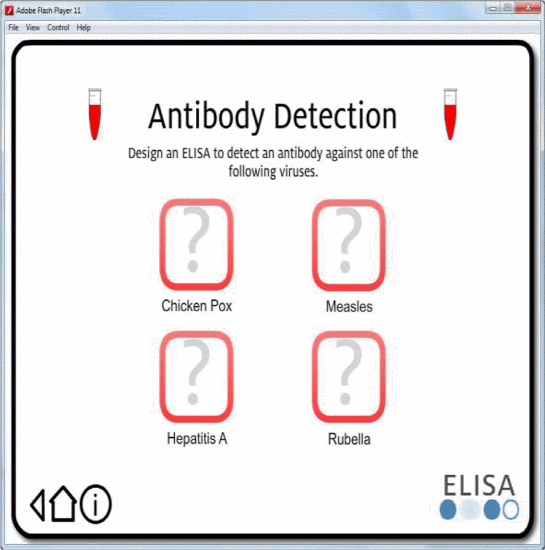

Antibody detection menu: kind of virus will be detected using the antibody detection menu respectively

## E. Main Board of ELISA Game
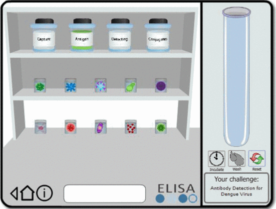

Mainboard of ELISA game: is the main board of the game and the users can do drag and drop the substances into the tube. Elements are also categorized, so the users can easily choose them.

## F. Drag and Drop Reagen
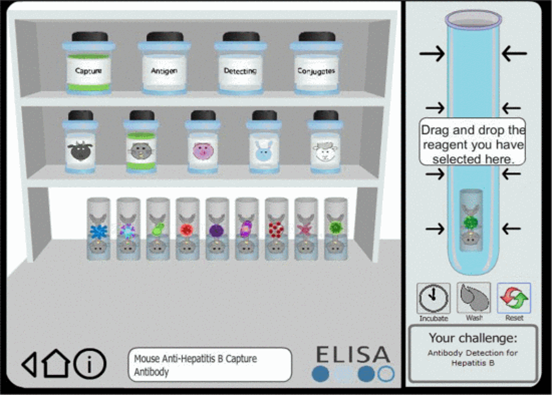

Mainboard of ELISA game: Users drag and drop the reagent.

## G. Correct Combination
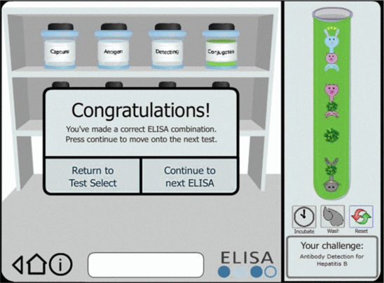

Mainboard of ELISA game: Users made A correct combination of ELISA.

# V. Testing
## A. Target User
- The main target users are third-year James Cook University science students. 
- The students are assumed to be familiar with biological concepts and have an understanding of how they are applied in ELISA. 
- The other remaining target group is teachers, who will use the application to view student results produced from the ELISA game.

Characteristics of users: 
- Age: approximately 20 years (science students), and above 30 years (teachers/lecturers)
- Gender: Female and Male
- Educational background: Veterinary Science
Language: English (as the main language of James Cook University, Australia)
- Computing skills: know the basic of computing
- Physical abilities and disabilities: perhaps there are disabled persons or color-blind persons who are amongst the target users.
- Domain-related knowledge and skills: biology

## B. Result of Implementation to user
- After implemented the game, usability testing was conducted among 42 third-year veterinary science students
- In term of efficiency, the results are users were able to navigate the application and locate the game screen with ease. The minimum amount of steps taken to solve the problem was 8. The longest test took 5–10 minutes with a significant number of clicks to get a solution.
- In term of accuracy, 3 out of 7 tests took submitted 2 incorrect combinations. The remaining 4 out of 7 submitted only 1 incorrect combination. Overall, all users eventually submitted a good combination. In addition, 3 out of 7 users submitted 4 elements in the incorrect order, 2 out of 7 users only submitted 1 incorrect element. The remaining two users submitted 2 incorrect elements

## C. Questionnaire
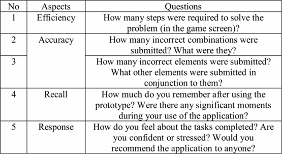

Some questions that were asked into the testers

## D. Result of Questionnaire
- For the last question about the response, users stated they liked the application and felt it was an enjoyable experience. Furthermore, several were unsure how to solve the problem but eventually found a solution.
- Regarding recall, users found the prototypes are easy to use. Once the users viewed the game they could remember elements and figure out how the ELISA test works.

# VI. Conclusion and Future Works
- ELISA game found to be usable for third-year veterinary science students. However, it has not been researched whether it is effective for learning ELISA compared to in a real laboratory. 
- ELISA game has not been tested among lecturers in the veterinary science department. 
- For future works, it is considered that Flash Action Script is no longer current technology for the game. It might be better to develop using other current game technologies, for example, Unity 3D.

# Note :
- Problem :
   - ELISA (Enzyme-linked immunosorbent assay) is a serological test to detect the two types of detections which are antigen detection (hepatitis B, dengue virus, Ross river virus, influenza, HIV and Herpes virus simplex 1) and antibody detection(chicken pox, measles, hepatitis A, rubella).
   - To conduct an ELISA test, there are several types of equipment that should be prepared, such as ELISA reader, washer machine, pipe, and microplate. 
   - Those equipment are in a various range of price and it will be costly to conduct a real test for a huge number of students. 

- Contribution :
   - Students can learn the combination to detect the two types of ELISA test using a simulation game and can decrease the cost of laboratory practice.

- Type :
  - ELISA game is a simulation game because it is fantastical but not competitive

- About Game :
  - Games are usually associated with play, and play is often associated with children. But a digital game has been found that can be effective and motivational for learning.
  - Since it was found that games support learning in complex or boring contexts, researchers have developed and research for effective games for helping education in various fields such as education, military, health and also training and development.

Summary :

Simulation games can help students to :
- Improve their understanding of a problem
- Increase students' interest in complex and boring material
- Reduce cost, time, or effort to make a real test/simulation.

Related to ongoing project :
- Create a simulation game to improve students' understanding and memorization of difficult and boring material such as the periodic chemistry table.
